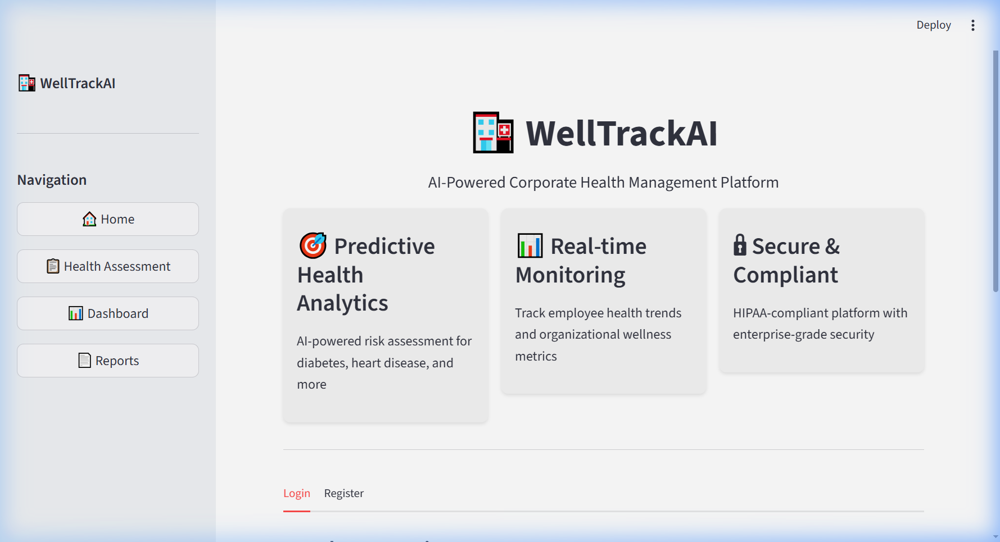
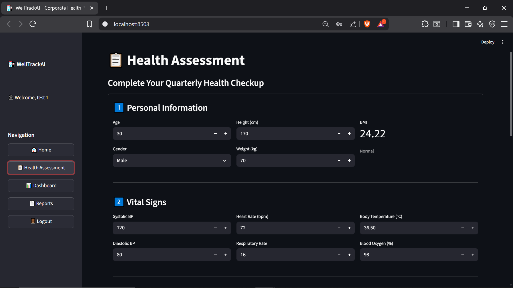
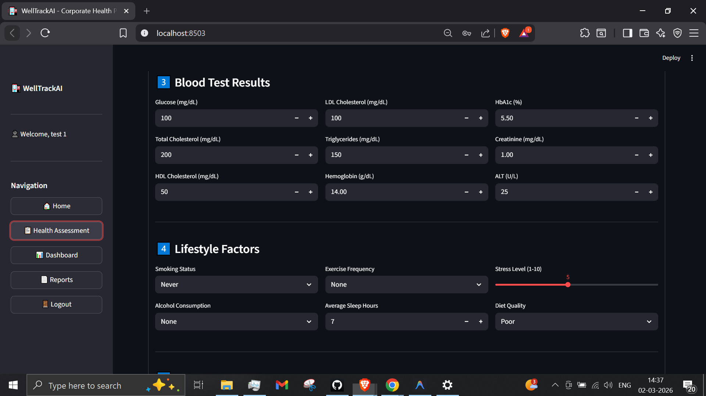
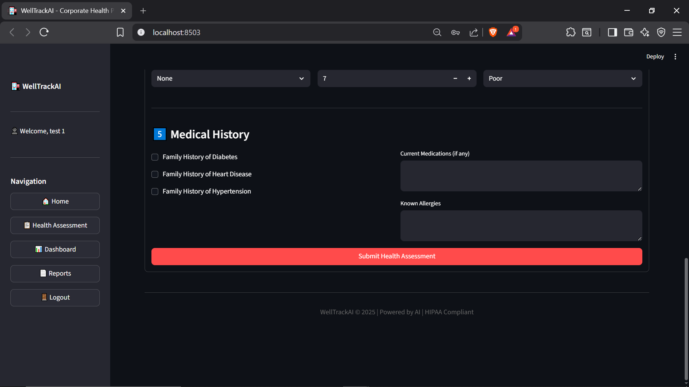
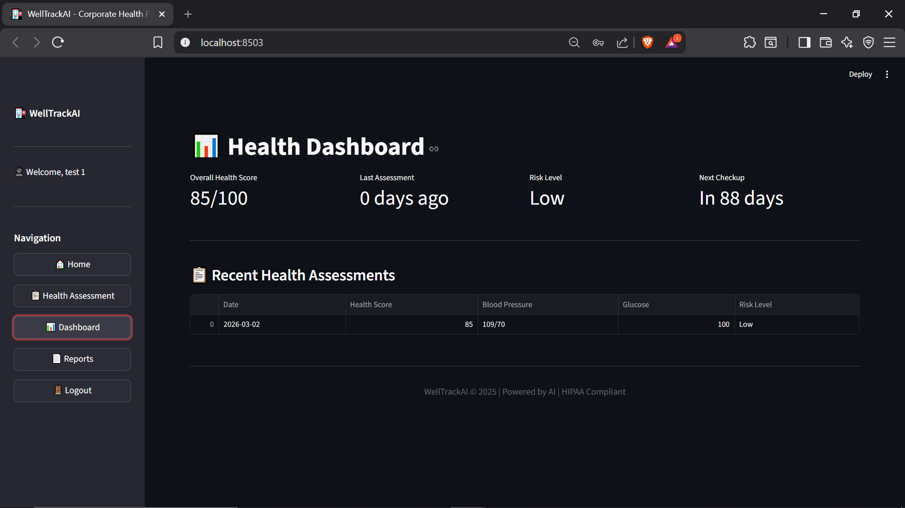
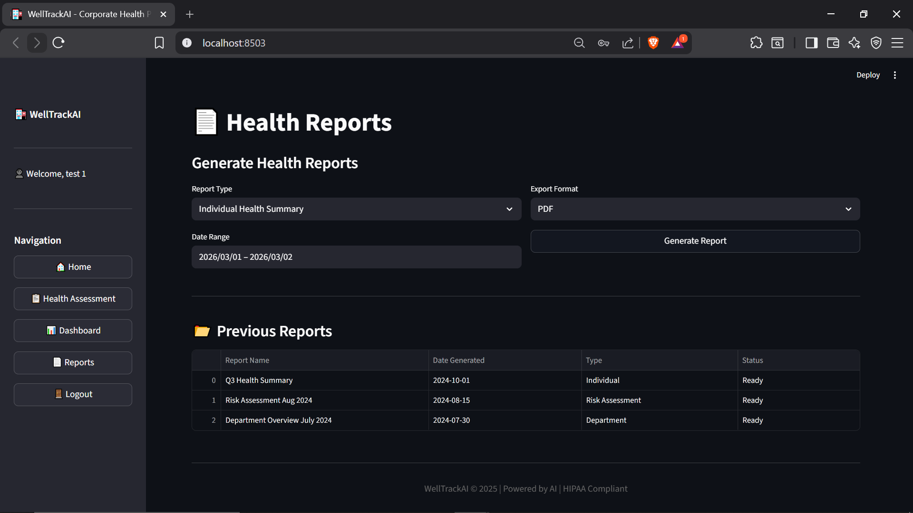

# 🏥 WellTrack AI — Corporate Health Management Platform


> A full-stack, AI-driven corporate wellness platform that tracks employee health metrics, predicts chronic disease risk through ensemble ML models, and generates actionable reports with automated email alerts — built with Streamlit, SQLAlchemy, and scikit-learn.

---

## 📸 Screenshots

| Home & Authentication | Health Assessment |
|---|---|
|  |  |

| Assessment — Vitals & Blood Tests | Assessment — Lifestyle & History |
|---|---|
|  |  |

| Analytics Dashboard | Reports & Export |
|---|---|
|  |  |

> *Run the app locally to explore the full interactive experience with real-time charts and downloadable PDF/CSV reports.*

---

## 🎯 Why I Built This

Most health prediction projects on GitHub stop at training a model on Kaggle and showing an accuracy number. I wanted to go beyond that — build something that actually resembles a **production-grade health product**.

This project started from a personal interest: how can workplaces proactively monitor employee wellness instead of reacting to sick days? The answer involved stitching together several pieces — a usable web interface, secure data persistence, intelligent risk scoring, and actionable outputs like PDF reports and email alerts.

Building this taught me a lot about:

- **End-to-end ML integration** — how a trained model actually serves predictions in a real app, with fallbacks when models aren't available
- **Database design for healthcare data** — normalizing patient records, linking assessments to risk scores, handling temporal data
- **Streamlit at scale** — session state management, multi-page navigation, and working within Streamlit's execution model
- **Production considerations** — environment-based config, graceful degradation, SMTP fallback to local logging

---

## ✨ Feature Breakdown

### 🔐 User Authentication

- Employee registration with department tagging
- SHA-256 password hashing with session-based login
- Role-aware fields (admin flag, company association)

### 📋 Health Assessment Engine

- Comprehensive 5-section form: **Personal Info → Vital Signs → Blood Tests → Lifestyle → Medical History**
- Real-time BMI calculation with instant classification (Underweight / Normal / Overweight / Obese)
- Rule-based risk scoring for **diabetes** and **cardiovascular disease** at submission time
- All assessment data persisted to a relational database with timestamps

### 📊 Interactive Dashboard

- **Blood Pressure Trends** — Systolic/Diastolic over time using Plotly line charts
- **Glucose & Cholesterol Tracking** — Multi-metric trend analysis across assessments
- **Risk Score Overview** — Overall health score, days since last assessment, current risk level
- **Assessment History Table** — Sortable, filterable records with risk categorization
- Placeholder-aware — gracefully shows empty-state charts when no data exists yet

### 🤖 ML Risk Prediction Pipeline

The optional training module (`models/train_model.py`) builds an **ensemble classifier** for disease risk prediction:

| Component | Details |
|---|---|
| **Base Models** | Random Forest, Gradient Boosting, Logistic Regression |
| **Optional Boosters** | XGBoost, LightGBM (auto-detected, graceful fallback) |
| **Class Balancing** | SMOTE oversampling (or simple upsampling if `imbalanced-learn` is absent) |
| **Feature Engineering** | Pulse pressure, mean arterial pressure, cholesterol ratios (Total/HDL, LDL/HDL), age risk groups, glucose categories |
| **Evaluation** | Accuracy, AUC-ROC, Precision, Recall, F1 — all computed per model and for the ensemble |
| **Ensemble Strategy** | Soft voting across top-3 models ranked by AUC |

The inference module (`models/predict.py`) loads serialized models and provides risk scores with rule-based fallbacks for stroke and hypertension.

### 📧 Email Notification System

- **Severity-based routing**: High risk → urgent alert + HR notification; Medium risk → warning email; Low risk → congratulations
- **SMTP integration** with Gmail (configurable via `.env`)
- **Graceful fallback**: If SMTP isn't configured, notifications are logged locally in `logs/notifications.log` — the app never crashes
- Full email templates with actionable next steps for employees and HR

### 📄 Report Generation

- **CSV Export** — Full health history with all metrics (BMI, BP, glucose, cholesterol, lifestyle factors)
- **PDF Reports** — Professional multi-section document via ReportLab:
  - Employee information header
  - Current health metrics table with status indicators and normal ranges
  - Risk assessment breakdown with percentage scores
  - Lifestyle factors summary
  - Personalized recommendations based on actual health data
- Reports are generated on-demand and downloadable directly from the browser

### 🔧 Advanced Visualization Module

The `app/visualizations.py` module (1400+ lines) provides a comprehensive `AdvancedDashboard` class with:

- Health score gauge charts
- Vital signs radar displays
- Risk breakdown charts by category
- Lifestyle radar charts (exercise, sleep, diet, habits scoring)
- Multi-metric trend analysis with configurable time windows
- Predictive trend charts with confidence intervals
- **Department-level analytics** — cross-department health comparisons, risk distribution, and concern analysis

---

## 🏗 Project Architecture

```
Welltrack-ai/
├── app.py                      # Streamlit entry point — pages, forms, session management
├── app/
│   ├── __init__.py             # Package metadata
│   ├── models.py               # SQLAlchemy ORM (Employee, HealthRecord, RiskAssessment, Company)
│   ├── database.py             # CRUD operations (create user, save records, query history)
│   ├── notifications.py        # Email notification service (SMTP + local fallback logging)
│   ├── visualizations.py       # Advanced Plotly dashboard (gauge, radar, trends, dept analytics)
│   └── export.py               # CSV + PDF report generator (ReportLab)
├── models/
│   ├── train_model.py          # ML training pipeline (ensemble, SMOTE, feature engineering)
│   ├── predict.py              # Inference module with rule-based fallbacks
│   └── saved_models/           # Serialized .pkl models (generated after training)
├── config/
│   └── settings.py             # Centralized config with env-var support and risk thresholds
├── requirements.txt
├── .env.example                # Environment variable template
└── .gitignore
```

### Data Flow

```
User Input (Streamlit Form)
    ↓
Health Record → SQLAlchemy ORM → SQLite / PostgreSQL
    ↓
Risk Scoring (rule-based + ML ensemble)
    ↓
  ┌─────────────────────────────────┐
  │  Dashboard (Plotly)             │
  │  Email Notification (SMTP)      │
  │  PDF / CSV Report (ReportLab)   │
  └─────────────────────────────────┘
```

### Database Schema

```
┌──────────────┐    ┌──────────────────┐    ┌─────────────────┐
│  companies   │    │   employees      │    │ health_records  │
│──────────────│    │──────────────────│    │─────────────────│
│ id (PK)      │◄───│ company_id (FK)  │    │ id (PK)         │
│ name         │    │ id (PK)          │◄───│ employee_id (FK)│
│ industry     │    │ employee_id      │    │ height, weight  │
│ size         │    │ first_name       │    │ bmi             │
└──────────────┘    │ last_name        │    │ systolic_bp     │
                    │ email            │    │ blood_glucose   │
                    │ department       │    │ cholesterol     │
                    │ password_hash    │    │ smoking_status  │
                    └──────────────────┘    │ sleep_hours     │
                           │                │ stress_level    │
                           │                │ recorded_at     │
                           │                └─────────────────┘
                           │
                    ┌──────────────────┐
                    │ risk_assessments │
                    │──────────────────│
                    │ id (PK)          │
                    │ employee_id (FK) │
                    │ health_record_id │
                    │ diabetes_risk    │
                    │ heart_disease_risk│
                    │ overall_risk_score│
                    │ risk_category    │
                    │ recommendations  │
                    └──────────────────┘
```

---

## 🚀 Getting Started

### Prerequisites

- Python 3.10 or higher
- pip

### Installation

```bash
# Clone the repository
git clone https://github.com/vaishnavak2001/Welltrack-ai.git
cd Welltrack-ai

# Create and activate virtual environment
python -m venv venv

# Windows
venv\Scripts\activate
# macOS / Linux
source venv/bin/activate

# Install dependencies
pip install -r requirements.txt
```

### Configuration

```bash
# Copy the environment template
cp .env.example .env
```

The app uses **SQLite by default** — no database setup required. If you want PostgreSQL, update `DATABASE_URL` in `.env`.

Email notifications are optional. Without SMTP credentials, the app logs notifications locally and continues working.

### Run the Application

```bash
streamlit run app.py
```

The app opens at **<http://localhost:8501>**

### Train ML Models (Optional)

To train the risk prediction models on your own dataset:

```bash
python models/train_model.py
```

This generates `.pkl` files in `models/saved_models/` consumed by the prediction engine. Without trained models, the app uses rule-based scoring as a fallback.

---

## 🧪 Tech Stack

| Layer | Technology | Purpose |
|---|---|---|
| **Frontend** | Streamlit, Plotly | Interactive UI, real-time charts, forms |
| **Backend** | Python, SQLAlchemy ORM | Business logic, database abstraction |
| **Database** | SQLite (dev) / PostgreSQL (prod) | Persistent health record storage |
| **ML Pipeline** | scikit-learn, XGBoost*, LightGBM* | Ensemble risk prediction, feature engineering |
| **Reports** | ReportLab (PDF), Pandas (CSV) | Professional downloadable health reports |
| **Notifications** | smtplib (SMTP) | Automated email alerts with severity routing |
| **Config** | python-dotenv | Environment-based configuration |

*\* Optional — the system detects availability at runtime and falls back gracefully.*

---

## 📈 ML Model Performance

The ensemble model combines multiple classifiers via soft voting. Performance on synthetic health data:

| Model | Accuracy | AUC | Notes |
|---|---|---|---|
| Random Forest | ~0.85 | ~0.88 | Feature importance, handles non-linear patterns |
| Gradient Boosting | ~0.83 | ~0.87 | Sequential error correction |
| Logistic Regression | ~0.78 | ~0.82 | Interpretable baseline |
| **Ensemble (Voting)** | **~0.87** | **~0.90** | **Best overall via soft voting** |

> Performance varies with dataset size and quality. For production use, train on actual clinical data with proper validation.

---

## ✅ What's Complete

- [x] User authentication — registration, login, session management
- [x] Health assessment form — 25+ parameters across 5 sections
- [x] Real-time BMI calculation with classification
- [x] Rule-based risk scoring (diabetes, cardiovascular)
- [x] Interactive dashboard with Plotly charts (BP trends, glucose/cholesterol tracking)
- [x] Assessment history with risk categorization
- [x] PDF health report generation (ReportLab) with download
- [x] CSV data export with download
- [x] Email notification system with severity-based routing and SMTP fallback
- [x] ML training pipeline — ensemble models, SMOTE, feature engineering
- [x] Advanced visualization module — gauge, radar, predictive charts, department analytics
- [x] SQLite + PostgreSQL dual database support
- [x] Environment-based configuration
- [x] Graceful error handling throughout

---

## 🔮 Roadmap — Future Improvements

- [ ] Deep learning for time-series health prediction (LSTM / Transformer)
- [ ] Wearable device integration (Fitbit, Apple Health API)
- [ ] Admin panel for HR — bulk employee management, org-wide analytics
- [ ] Multi-tenant architecture for multiple companies
- [ ] REST API layer (FastAPI) for mobile app integration
- [ ] OAuth2 / SSO authentication
- [ ] Data anonymization pipeline for full HIPAA compliance
- [ ] Automated model retraining with incoming assessment data
- [ ] Dockerized deployment with CI/CD

---

## 🤝 Contributing

1. Fork the repository
2. Create a feature branch (`git checkout -b feature/your-feature`)
3. Commit your changes (`git commit -m 'Add your feature'`)
4. Push to the branch (`git push origin feature/your-feature`)
5. Open a Pull Request

---

## 📄 License

This project is open source and available under the [MIT License](LICENSE).

---

*Built by [Vaishnav AK](https://github.com/vaishnavak2001) — exploring the intersection of AI and healthcare.*
